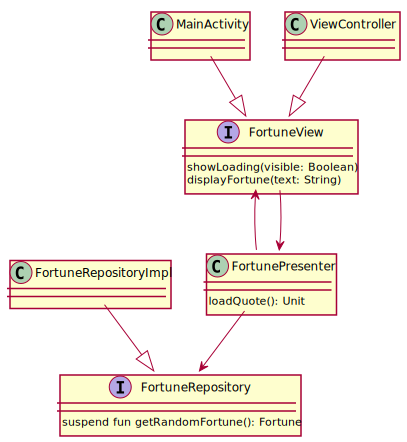

# Kotlin Multi-platform #

## Introduction ##

The goal of this introductory workshop is to introduce you to the basic
structure of a Kotlin multi-platform application, by building a toy app.

The application itself is a simple fortune app, which displays random fortunes
from a backend server at https://monkeyconf.herokuapp.com/fortunes. User will
also have the possibility to save a fortune in its favorites.

We will use
[Model-View-Presenter](https://en.wikipedia.org/wiki/Model–view–presenter) and
elements of [Clean
architecture](http://blog.cleancoder.com/uncle-bob/2012/08/13/the-clean-architecture.html)
to help us structure our multi-platform application.

The presenter will contain the high-level logic of our screen, and will be
decoupled from the "low-level" implementation details (user interface and data
access) using interfaces.

Here is a simplified UML Diagram :



As mentioned during the presentation, code source is structured in the following way :
  
    src/
         commonMain/ : common code
         commonTest/ : common test code
         iosMain/    : iOS specific code
         iosTest/    : iOS specific test code
         main/       : Android specific code
         test/       : Android specific code
         
## Exercise 1 : Create the Model ##

After loading the project into IntelliJ Idea, the application code should compile :

``` shell
./gradlew assembleDebug
```

However, tests will not compile. 

``` shell
./gradlew testDebugUnitTest
```

Implement a Fortune model in Fortune.kt, with the following specification :
  * id: an Int
  * quote: a String

It should be an immutable [dataclass](https://kotlinlang.org/docs/reference/data-classes.html) 
and should be serializable using [Kotlinx Serialization](https://github.com/Kotlin/kotlinx.serialization).

After implementing the model, test code will compile and FortuneTest should pass.

``` shell
./gradlew testDebugUnitTest --tests FortuneTest
```

## Exercise 2 : Data access ##

As mentioned earlier, the fortunes data is not stored locally, but exposed by a
REST API at https://monkeyconf.herokuapp.com/fortunes.

As we don't want to pollute our presenter code with details on how to access
this HTTP API, we will implement data access in a separate `FortuneRepositoryImpl`
class which implements methods in `FortuneRepository`.

(Doing this separation will make our Presenter logic easily testable, by mocking
the `FortuneRepository` interface)

Fortunately, thanks to Kotlinx Serialization and Ktor HTTP client library we can
implement `FortuneRepositoryImpl` in a cross-platform way.

Using JsonFeature, create a Ktor HTTP client able to deserialize `Fortune` data.
https://ktor.io/clients/http-client/features/json-feature.html

Then implement the `getRandomFortune()` method, by performing a GET call to the
URL provided in the constructor.

You will notice that this method is declared using the `suspend` keyword. This
means that `getRandomFortune` will need to be called from a coroutine, and that
it will suspend the coroutine (but the underlying thread will be released) and
resume it when data is available.

This would be equivalent to call a function with a callback, however thanks to
the Kotlin compiler and coroutine machinery, we avoid the callback "hell" and we
can write code that looks sequential while being non-blocking.

Validate your implementation by passing the following test.

``` shell
./gradlew testDebugUnitTest --tests FortuneRepositoryImplTest
```

(Note: this test will use WireMock to setup a temporary HTTP server, mocking the
backend interface)

## Exercice 3 : The presenter ##

The presenter will act on the UI, through the `FortuneView` interface, and
access data through the `FortuneRepository` interface. Its role is to
orchestrate theses interfaces to perform high level logic of the screen.

Here is the description of the use-cases :
  * The user launch the screen
  * A new fortune is requested, and a loading indicator is displayed to user.
  * When the request completes :
      * If the requested succeeded, hide the indicator and show the fortune text
        to user. Keep the fortune in memory so we can save it as favorite later.
      * If the request failed, hide the indicator and show an error message to
        the user.
        
  * When the user request another fortune, the same steps as above are performed.

To ensure the interaction with FortuneView is done by the UI Thread (we have the
similar concept in Android and iOS), we start a coroutine using the
uiDispatcher. Platform-specific implementation of this Dispatcher will be passed
to the presenter during its creation.

The FortunePresenterTest will guide you to implement the desired behavior.

As usual, run the tests and validate your implementation using the following command :

``` shell
./gradlew testDebugUnitTest --tests FortunePresenterTest
```

## Exercise 4 : The view ##

Now that we have our Model and our Presenter ready, let's implement the View !
On Android the View is implemented by MainActivity. On iOS it is implemented by
a ViewController. 

To help you we have created a basic (but functional) layout/storyboard of the
screen.

Your job is to implement the FortuneView methods in these classes.

The iOS part will be need to be done with Xcode using the Swift language.

You now have a (hopefully !) fully working fortune app !

## Bonus exercise : Favorites ##

We now want to allow the user to save a favorite fortune.
As the favorite data is quite small we will save it in user settings.
On Android we can use `SharedPreferences`, on iOS we can use `NSUserDefaults`.

Unfortunately we cannot yet implement it using only common code.
A part of the common logic is implemented in `FavoriteFortuneRepositoryImpl`
(list management, serialization to JSON), but platform specific calls are made
through PreferenceHelper.

Using the guidelines at
https://kotlinlang.org/docs/reference/platform-specific-declarations.html, we
have defined `PreferenceHelperImpl` as an expect class, and actual
implementation in platform specific packages. Go and provide the actual
implementations for each platform.
